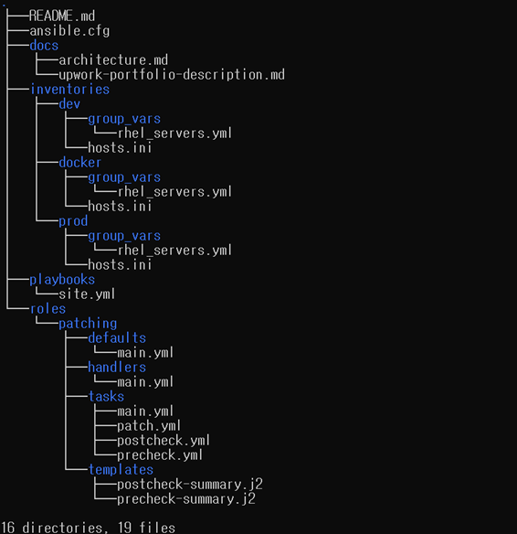
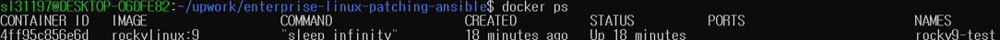
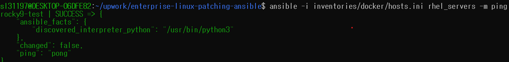
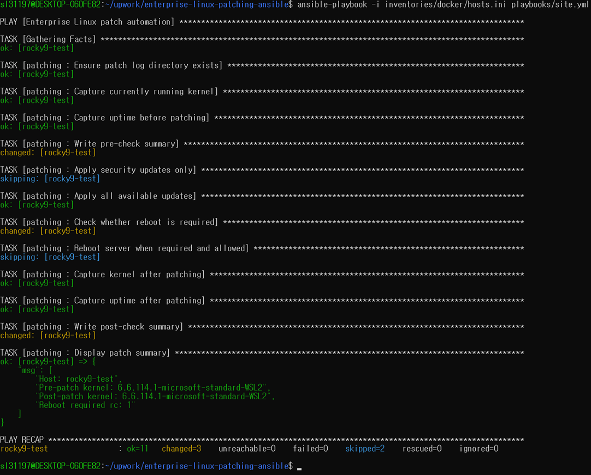

# Enterprise Linux Patch Automation with Ansible

Production-style Ansible framework for automating patch management across RHEL-compatible Linux servers.

This repository demonstrates enterprise automation practices using role-based architecture and Infrastructure as Code principles.

---

## Overview

Managing Linux patching manually becomes difficult as infrastructure scales.

This project provides a reusable Ansible framework designed for:

* Enterprise Linux environments
* Repeatable patching workflows
* Environment-specific configurations
* Reliable and maintainable operations

---

## Features

* Role-based Ansible architecture
* Hierarchical inventories
* Environment-specific variables
* group_vars and host_vars support
* Security-only patch mode
* Full patch mode
* Package exclusion support
* Automatic reboot handling
* Pre-check and post-check validation
* Idempotent execution
* Patch execution logging

---

## Architecture

```text
site.yml
    ↓
patching role
    ↓
precheck.yml
    ↓
patch.yml
    ↓
reboot
    ↓
postcheck.yml
```

---

## Project Structure

```text
.
├── inventories
│   ├── dev
│   │   ├── group_vars
│   │   └── host_vars
│   └── prod
│       ├── group_vars
│       └── host_vars
├── playbooks
│   └── site.yml
├── roles
│   └── patching
│       ├── defaults
│       ├── handlers
│       ├── tasks
│       │   ├── precheck.yml
│       │   ├── patch.yml
│       │   └── postcheck.yml
│       ├── templates
│       └── vars
├── docs
└── README.md
```

---

## Technologies

* Ansible
* Red Hat Enterprise Linux (RHEL)
* Oracle Linux
* YAML
* Jinja2
* Infrastructure as Code

---

## Example Usage

Run against the development inventory:

```bash
ansible-playbook \
-i inventories/dev/hosts.ini \
playbooks/site.yml
```

Run in check mode:

```bash
ansible-playbook \
-i inventories/dev/hosts.ini \
playbooks/site.yml \
--check
```

---

## Design Principles

The framework is designed with the following goals:

* Maintainability
* Reusability
* Idempotency
* Separation of logic and configuration
* Environment-specific customization
* Production-style role structure

---

## Intended Use Cases

* Enterprise Linux patch automation
* RHEL lifecycle management
* Standardized patching workflows
* Infrastructure as Code initiatives
* Repeatable and auditable operations

---

## Future Enhancements

Planned improvements:

* GitHub Actions CI pipeline
* yamllint
* ansible-lint
* Molecule testing
* Health checks
* Rollback capability
* Email notifications
* Slack notifications

---
## Screenshots

### Project Structure



---

### Docker Test Environment



---

### Ansible Connectivity Test



---

### Successful Playbook Execution




---

## Disclaimer

This repository is a portfolio project created to demonstrate enterprise automation practices.

No proprietary company code, confidential information, or customer data is included.
